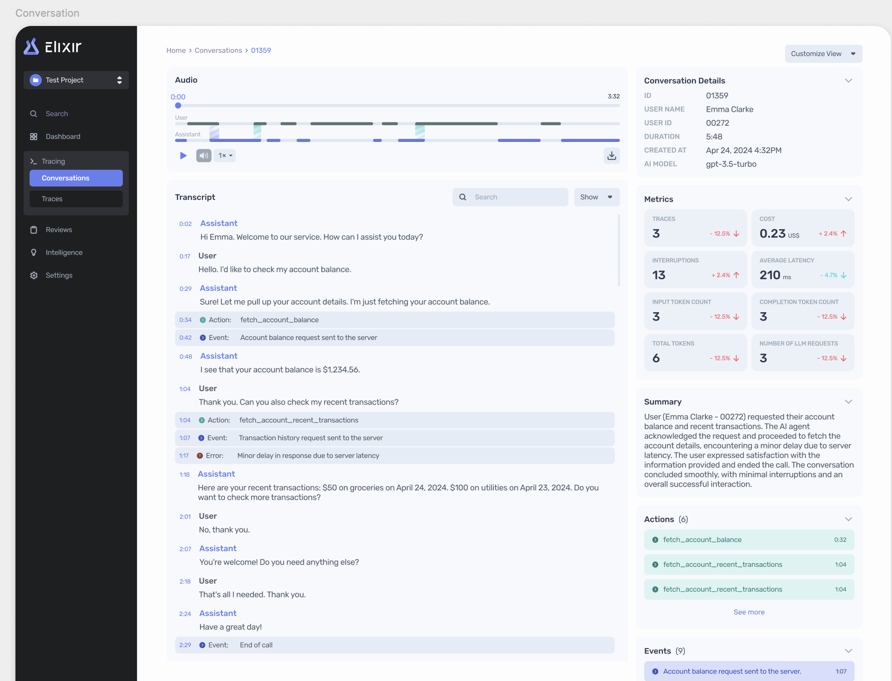

# Uploading Twilio Audio to S3

After a conversation finishes, we want to store the audio on behalf of our customers. A common case would be downloading the audio from a Twilio call.

## Part 1: Download the Twilio recording audio

### Implementation

- You can assume that we’re using the [Dial](https://www.twilio.com/docs/voice/twiml/dial) TwiML verb.
- Implement a function `handle_incoming_call` that utilizes the Dial verb and defines the appropriate parameters and callbacks.

### Discussion

- What are the benefits to downloading the **wav** or the **mp3**?
- We want to analyze the audio to identify metrics like interruptions, speaking time for the user/agent, etc. What are the benefits to using **mono-channel** or **dual-channel**?

## Part 2: Upload the Twilio audio to our S3 bucket

### Implementation

- You can assume that we’re using the [boto3](https://boto3.amazonaws.com/v1/documentation/api/latest/index.html) package.
- Now that we've successfully downloaded the Twilio recording, implement the functions necessary to upload the recording to S3.

### Discussion

- Imagine that you are building this as a utility function within our API/SDK. What are the pros & cons of your approach?
- Given the B2B nature of our application, how would you organize the buckets and files so that we can easily associate these recordings with individual conversations?
- How does your approach scale for large audio files?
