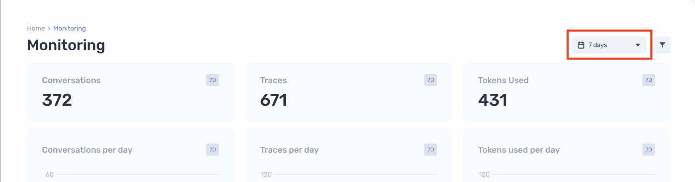
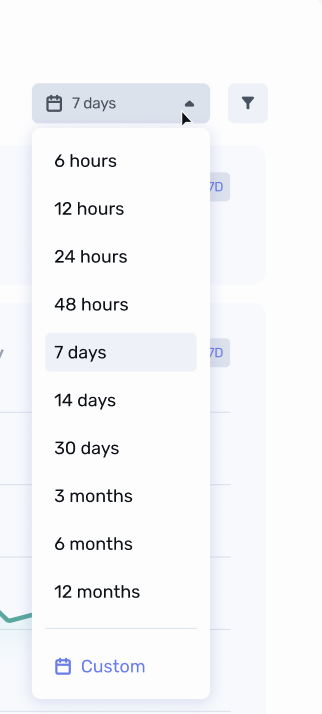
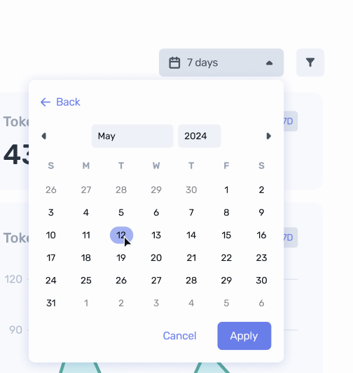

# Date Range Picker

## Overview

You will implement a date range picker in React with TypeScript. The date range picker will have predefined date ranges as well as a custom date range option.

### Part 1: Implement the Popover/Menu

Use any styling library (e.g., Material-UI, TailwindCSS, Bootstrap) to implement a popover or menu component that will house the date range options.

### Part 2: Enumerated Options

Add the predefined date ranges to the popover/menu.

### Part 3: Returning State

Utilize the date picker in a controlled manner (with an explicit value and change handler).

### Part 4: Custom Date Option

Add a custom date range option using an external date picker library (e.g., `react-datepicker`). How can you extend your existing implementation?
